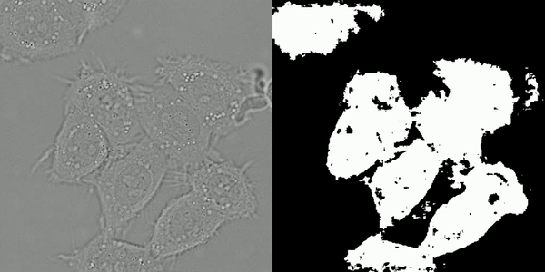
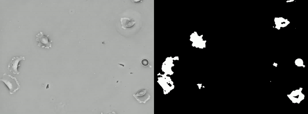

This model is developed for a graduation project in university.

# Dependencies

    tensorflow==2.4.1
    opencv
    keras
 
# Usage

The datasets from http://celltrackingchallenge.net/2d-datasets/ should be downloaded in order to use the pretrained models. The datasets are;

    DIC-C2DH-HeLa
    PhC-C2DH-U373

# Examples

